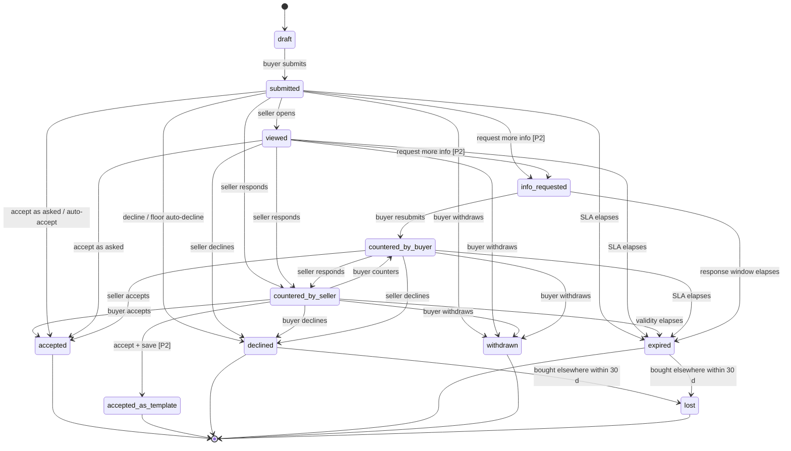

# Product Requirements Document — Special Price Request & RFQ

**Product:** HIGHBASE B2B distribution platform
**Feature area:** Price negotiation (Buyer Marketplace · Buyer Dashboard · Seller Dashboard)
**Document owner:** Abdelrahman Eltayep, Senior Product Designer
**Status:** Draft for engineering review · **Version:** 1.0 · **Date:** August 2026
**Scope:** Phase 1 and Phase 2 in one document. Every requirement is tagged **[P1]** or **[P2]** so the release line can be cut at any point.
**Companion documents:** `HIGHBASE-Special-Price-RFQ-Benchmark.md` (competitor analysis, sourced) · `highbase-special-price-prototype.html` (clickable concept) · `HIGHBASE-Special-Price-RFQ-Benchmark.pptx` (stakeholder deck)

---

## Reading this document

| Convention | Meaning |
|---|---|
| **[P1]** | Phase 1 — the RFQ / negotiation engine. Ships first, independently useful. |
| **[P2]** | Phase 2 — the proof-of-price half. Depends on Phase 1 being live. |
| `FR-n` | Functional requirement. Every one is independently testable. |
| `US-n` | User story with acceptance criteria in Given / When / Then form. |
| `EC-n` | Edge case or error condition with required system behaviour. |
| `M-n` | Success metric. |
| `Q-n` | Open question. Anything marked **BLOCKER** must be closed before the phase it belongs to enters development. |
| **MUST / SHOULD / MAY** | RFC 2119 sense. MUST is a release gate; SHOULD is a strong default an owner may waive in writing; MAY is optional. |

Three structural decisions were taken before this document was written, on the evidence in the benchmark. They are stated here as requirements, not options, because acceptance criteria cannot be written against an undecided model. Their rationale is in §6.6.

1. **A request is order-level.** One request contains N lines. It is never one request per SKU.
2. **The negotiation object is separate from the order object.** Declining a price never blocks or reopens an order.
3. **Case 1 outcomes are tri-state** — matched / beaten / declined — not a binary approve/reject.

---

## 1. Executive Summary & Objectives

### 1.1 Summary

HIGHBASE buyers and sellers negotiate prices today, but they do it outside the platform — over WhatsApp, phone and email — and then someone re-keys the agreed number into an order. The negotiation is invisible to HIGHBASE: it cannot be measured, audited, priced, or improved, and the agreed price does not persist, so the same conversation happens again next month.

This feature brings that negotiation inside the product in two forms:

- **Case 2 — Request for Quote (RFQ).** The buyer states a quantity and asks the seller to quote. This is a commodity capability; every benchmarked B2B platform ships it, and they have converged on the same object model and state machine. HIGHBASE should copy the reference implementation (Adobe Commerce Negotiable Quotes) rather than invent one.
- **Case 1 — Special Price Request with proof.** The buyer states a target price and uploads an invoice, quote or screenshot evidencing that price elsewhere. **No B2B commerce platform benchmarked has this capability** — not Adobe, not Shopify or any of its 15 quote apps, not BigCommerce, OroCommerce, Amazon Business or Alibaba. The only precedents are consumer retail price-match claim forms and manual distributor "meet-or-beat" email workflows. This is the differentiated half of the feature and carries the majority of the product and policy risk.

The two cases share one request container, one state machine, one SLA clock and one audit log. They differ only in what the buyer supplies and what the seller must verify.

### 1.2 Business objectives

| # | Objective | Why it matters |
|---|---|---|
| O1 | Move price negotiation onto the platform | Negotiation is currently the largest un-instrumented part of the buyer–seller relationship. Every round that happens off-platform is a data loss and an audit gap. |
| O2 | Reduce time-to-agreed-price | Off-platform negotiation has no SLA. A published 24-hour response commitment with a visible countdown is the cheapest trust mechanism available and is standard at Newegg, Amazon Business and KG Supplies. |
| O3 | Make agreed prices persistent | An accepted price that is not written into a customer price list is a conversation that must be repeated. Adobe's Quote Templates is the only working implementation of this in the benchmark; nobody in the Shopify ecosystem does it at all. |
| O4 | Protect seller margin by default | Rules must handle the common cases — floor price auto-declines, small asks auto-accept — so that negotiation volume does not scale linearly into seller headcount. |
| O5 | Establish a defensible proof-of-price capability | Case 1 is genuine whitespace. Shipping it well, with a real fraud and abuse policy, is a differentiator that competitors cannot copy quickly because the hard part is policy and trust, not OCR. |

### 1.3 Goals

**Phase 1 [P1] — the negotiation engine**

- G1. A buyer can create one multi-line request from a product card and track it to a decision without leaving HIGHBASE.
- G2. A seller can triage a queue of requests and decide most of them without opening the detail view, because the queue shows margin impact.
- G3. Both parties always know whose turn it is, from a single stored state rendered with actor-appropriate labels.
- G4. Every state change, price change and message is recorded in an immutable, exportable audit log.
- G5. A negotiation always terminates — by acceptance, decline, expiry, withdrawal or round exhaustion. No state can persist indefinitely.

**Phase 2 [P2] — proof of price and persistence**

- G6. A buyer can attach evidence for a target price, and the system extracts and validates it before a human reads it.
- G7. A seller can send a request back for better evidence without declining it.
- G8. An accepted price can be written into the buyer's price list with validity dates and quantity thresholds, in one action.
- G9. Fraudulent and abusive proof submissions are detected, rate-limited and attributable.

### 1.4 Non-goals

Explicitly out of scope for both phases. Each is listed with the reason, so it does not get re-litigated in sprint planning.

| # | Non-goal | Reason |
|---|---|---|
| N1 | One-to-many RFQ (broadcast to multiple sellers) | Alibaba and Amazon Business both do this; it changes the object model (one request, N seller responses, buyer picks one) and the marketplace dynamics. Deferred to a later phase, but the schema MUST NOT preclude it — see FR-1.9. |
| N2 | Freeform chat between buyer and seller | Comments are structured, threaded and attached to the request. A general messaging product is a separate initiative. |
| N3 | Automated price optimisation or recommendation engine | The seller decides. The system surfaces margin; it does not suggest a counter price. |
| N4 | Negotiating anything other than unit price | Not payment terms, not delivery windows, not shipping cost, not credit limits. Those are order-level and separately owned. |
| N5 | Renegotiating a confirmed order | Once an order is confirmed at an agreed price, changing it is a returns/credit-note problem, not a negotiation problem. |
| N6 | Buyer-facing visibility of seller margin, cost or floor price | Margin data is seller-only and MUST never appear in any buyer-facing payload. See FR-4.8. |
| N7 | Public or anonymous requests | A request always has an identified buyer account and an identified seller. No guest flow. |
| N8 | OCR of handwritten documents | Out of scope for the extraction service. Handwritten proof falls back to manual seller review. |
| N9 | Replacing existing volume/tier pricing | Tiered pricing stays as it is. The feature's job is to *show* the existing tier before the buyer asks (FR-2.3), not to replace tiers. |
| N10 | Negotiation on the Sell Globally / Buy Globally channels | Phase 1 and 2 cover local (in-Bahrain) buyer↔seller relationships only. Cross-border adds customs, incoterms and currency to every price. |

### 1.5 Phasing rationale

Phase 1 first is deliberate. It is the half with five working implementations to copy, so its design risk is near zero, and it produces the container, state machine, SLA engine, audit log and notification surface that Phase 2 needs. Phase 2 then adds only the proof panel, the extraction service, the fifth seller action and the price-list write-back. Sequencing them the other way would mean building the risky, un-precedented half on top of nothing.

---

## 2. User Personas & Pain Points

### 2.1 Primary personas

#### P1 — Nawaf, Purchasing Manager (Buyer, mid-size grocery chain)

| | |
|---|---|
| **Context** | Buys 200–400 SKUs a month across 6–10 suppliers for 4 stores. Sits in front of HIGHBASE and a spreadsheet at the same time. Arabic-first, comfortable in English UI. |
| **Volume** | 15–30 negotiations a month, usually bundled into a weekly purchasing cycle. |
| **Goal** | Land the whole week's basket at the best achievable price without spending the week chasing it. |

**Pain points**

- PP1.1 — Negotiates on WhatsApp with five different reps, then re-keys agreed prices into orders by hand. Transcription errors are common and only surface at invoice.
- PP1.2 — Has no record of what was agreed last month, so the same price is renegotiated repeatedly, sometimes at a worse number.
- PP1.3 — Has a competitor's invoice showing a better price and no structured way to present it. Sending a photo on WhatsApp works only if the rep happens to be responsive.
- PP1.4 — Never knows when a reply is coming, so chases. Chasing is the single largest time cost.
- PP1.5 — When a seller comes back on a five-line request, cannot tell at a glance which lines moved and what the basket now costs.

#### P2 — Huda, Small Retailer / Owner-operator (Buyer)

| | |
|---|---|
| **Context** | One shop, orders on a phone, mostly in Arabic, usually outside business hours. Low platform literacy; will abandon any flow longer than about 60 seconds. |
| **Volume** | 2–5 negotiations a month, small baskets, high price sensitivity. |
| **Goal** | Find out quickly whether a better price is possible, without a conversation. |

**Pain points**

- PP2.1 — Does not know that asking for a better price is even possible, or which suppliers entertain it.
- PP2.2 — Quantity thresholds are invisible: often asks for a discount at a volume that already has a published tier, and vice versa.
- PP2.3 — Uncertain what "proof" means or what is acceptable; a rejected claim with no stated reason is experienced as a rejection of her.
- PP2.4 — Mobile-first. Any flow requiring a desktop, or a file that is not already on the phone, will not be completed.

#### P3 — Yousef, Sales Representative (Seller, FMCG distributor)

| | |
|---|---|
| **Context** | Owns 40–60 buyer accounts. Works from the HIGHBASE seller dashboard plus a pricing sheet from his commercial manager. Has a floor price per SKU he is not permitted to cross. |
| **Volume** | Expects 20–60 requests a week once the feature is live. |
| **Goal** | Clear the queue before lunch without giving away margin. |

**Pain points**

- PP3.1 — Cannot tell, from a request, what it does to margin. Answering requires opening a spreadsheet, which is why replies take a day or more.
- PP3.2 — Cannot distinguish a strategic account's request from a marginal one in the same list.
- PP3.3 — Receives illegible or irrelevant proof and has only two blunt options — accept or decline — when what he needs is "send it back and ask again."
- PP3.4 — Agrees a price, and then has to remember it, because nothing writes it anywhere.
- PP3.5 — Answers the same request from the same buyer on the same SKU repeatedly.

#### P4 — Layla, Commercial / Pricing Manager (Seller, supervisor)

| | |
|---|---|
| **Context** | Sets floor prices and discount policy for the distributor. Does not handle individual requests; audits outcomes weekly. |
| **Goal** | Ensure no rep sells below floor, and understand where margin is leaking. |

**Pain points**

- PP4.1 — No visibility of what reps concede, in aggregate or by SKU.
- PP4.2 — No mechanism to enforce a floor other than instruction and trust.
- PP4.3 — Cannot see win/loss: whether a declined request meant a lost order or an order placed at list price anyway.

### 2.2 Secondary personas

#### P5 — Mariam, HIGHBASE Operations / Support

- PP5.1 — Will receive "the supplier never replied" and "my proof was rejected unfairly" tickets and needs a single, complete, immutable timeline per request to adjudicate them.
- PP5.2 — Needs to identify and act on abusive proof submissions (forged, reused, or out-of-policy documents) without reading every file.

#### P6 — HIGHBASE Finance / Legal

- PP6.1 — Needs a defensible answer to "who is liable when a forged invoice results in an approved price." Open — see Q-1, a launch blocker for Phase 2.

### 2.3 Persona-to-goal traceability

| Persona | Primary goals served | Key requirements |
|---|---|---|
| P1 Nawaf | G1, G3, G5, G8 | FR-2 (creation), FR-4 (comparison), FR-8 (price list) |
| P2 Huda | G1, G3 | FR-2.3 (tier shown first), FR-2.2 (route choice), FR-9 (notifications), FR-11 (mobile, Arabic) |
| P3 Yousef | G2, G4, G7 | FR-5 (queue with margin), FR-6 (five actions), FR-7 (proof panel) |
| P4 Layla | G4, G9 | FR-10 (rules & floor), FR-12 (audit & reporting) |
| P5 Mariam | G4, G9 | FR-12 (history log), FR-7.6 (abuse flags) |

---

## 3. User Stories & Acceptance Criteria

Acceptance criteria are written in Given / When / Then form and are intended to be lifted directly into test cases. Each story carries its phase tag and the functional requirements it depends on.

### 3.1 Buyer — creating a request (Buyer Marketplace)

**US-1 [P1] — Discover that negotiation is possible**

*As a buyer, I want to see a clear way to ask for a better price on the product card, so that I know negotiation is possible without being told by a sales rep.*

- **AC-1.1** — Given a product from a seller I am linked to, and the product is eligible (FR-2.1), when I view the product card, then a **Request special price** action is visible directly beneath the price, not inside an overflow menu.
- **AC-1.2** — Given I am not yet linked to this seller, when I view the product card, then the action reads **Request my price** and initiates the link request as its first step.
- **AC-1.3** — Given the product is not eligible for negotiation, when I view the product card, then the action is not rendered at all. A disabled control MUST NOT be shown in its place.
- **AC-1.4** — Given the product has published volume tiers, when I view the product card, then the tier ladder is visible before I open the request flow.
- **AC-1.5** — Given I already have an open request containing this SKU with this seller, when I view the product card, then the action reads **View my request** and deep-links to it.

**US-2 [P1] — State quantity before price**

*As a buyer, I want to enter my quantity first, so that the seller is answering the question I am actually asking — "is this cheaper at my volume?"*

- **AC-2.1** — Given I opened the request flow, when the first step renders, then quantity is the only required input on that step.
- **AC-2.2** — Given the SKU has volume tiers, when I enter a quantity that falls into a tier better than the price I am currently seeing, then the applicable tier price is displayed inline with a one-tap **Use this price** action that closes the flow without creating a request.
- **AC-2.3** — Given I enter a quantity below the seller's negotiation minimum (FR-2.1), when I attempt to continue, then I am blocked with a message stating the minimum, and the minimum value is shown numerically.
- **AC-2.4** — Given quantity is expressed in cases, when I enter it, then the equivalent unit count and the unit of measure are displayed alongside.
- **AC-2.5** — Given I enter a non-numeric, zero, negative or fractional-where-not-permitted quantity, when I attempt to continue, then inline validation blocks progression and names the constraint.

**US-3 [P1] — Choose the route explicitly**

*As a buyer, I want to choose between matching a price and asking for a quote, so that I am never guessing why a field is unavailable.*

- **AC-3.1** — Given I completed the quantity step, when the route step renders, then exactly two selectable cards are presented: **"I have a price to match"** (Case 1) and **"Ask the seller to quote"** (Case 2).
- **AC-3.2** — Given neither card is selected, when I attempt to continue, then progression is blocked and no downstream fields are rendered.
- **AC-3.3** — Given Phase 2 is not enabled for this seller or tenant, when the route step renders, then the Case 1 card is not rendered and the flow proceeds directly to the Case 2 form. A disabled Case 1 card MUST NOT be shown.
- **AC-3.4** — Given I selected a route, when I navigate back, then my selection is preserved and previously entered route-specific data is retained for the duration of the session.
- **AC-3.5** — The system MUST NOT infer the route from the presence or absence of an attachment, and MUST NOT disable a price input to signal that a file is required.

**US-4 [P2] — Submit a target price with proof**

*As a buyer, I want to state a target price and attach the invoice that proves it, so that my claim is taken seriously without a phone call.*

- **AC-4.1** — Given I selected Case 1, when the form renders, then four inputs are present: target price per unit, competitor/supplier name, their SKU or reference, and a file upload.
- **AC-4.2** — Target price, supplier name and file are required; their SKU is optional but prompted.
- **AC-4.3** — Given I upload a supported file (FR-7.1), when upload completes, then extraction runs and the extracted supplier, SKU, unit price and document date are displayed in editable fields, each labelled as **extracted — please confirm**.
- **AC-4.4** — Given extraction returns a value that conflicts with what I typed, when the result renders, then the conflict is shown inline with both values and I am asked to confirm which is correct. The typed value is authoritative for the submitted record; the extracted value is stored alongside it.
- **AC-4.5** — Given any auto-check fails (FR-7.3), when the result renders, then a non-blocking inline warning states which check failed and why, and I may correct the submission or submit anyway with the request flagged.
- **AC-4.6** — Given my target price is above the current list price, when I attempt to continue, then I am blocked with an explanatory message.
- **AC-4.7** — Given extraction is unavailable or times out, when I complete the form, then I can still submit; the request is marked `extraction_unavailable` and routed for manual seller review. See EC-27.
- **AC-4.8** — Uploaded file, extracted values and typed values MUST all be persisted; the file MUST be retrievable from the request for the full retention period (FR-12.5).

**US-5 [P1] — Ask for a quote without proof**

*As a buyer, I want to simply ask a seller to quote my volume, so that I can start a conversation when I have no competing price to cite.*

- **AC-5.1** — Given I selected Case 2, when the form renders, then quantity (pre-filled from US-2), frequency and an optional note to the seller are present.
- **AC-5.2** — Frequency is a picker with the values *One-off · Weekly · Fortnightly · Monthly*, never free text. In Phase 1 it is captured and displayed but drives no automation.
- **AC-5.3** — The note field accepts up to 500 characters, is optional, and is sanitised on submission (FR-13.4).
- **AC-5.4** — No file upload is offered on the Case 2 form in Phase 1.

**US-6 [P1] — Build one request from several products**

*As a buyer, I want to add several SKUs to the same request, so that I get one decision on one basket instead of five separate negotiations.*

- **AC-6.1** — Given I completed a line, when the flow continues, then **Add another item** is offered and returns me to product selection with the request retained.
- **AC-6.2** — Given a request is in progress, when I browse the marketplace, then a persistent indicator shows **N items in this request** and links back to it.
- **AC-6.3** — Each line independently carries its own route (Case 1 or Case 2), its own quantity, and its own proof.
- **AC-6.4** — All lines in a request MUST belong to the same seller. Adding a SKU from a different seller prompts me to start a second request and does not silently split the first.
- **AC-6.5** — A request MUST contain between 1 and 20 lines. Attempting to exceed the maximum is blocked with the limit stated.
- **AC-6.6** — Given I abandon the flow, when I return within the draft retention window (FR-2.8), then the draft is restored intact.

**US-7 [P1] — Review before submitting**

*As a buyer, I want to see original versus asked across the whole request, so that I know what I am asking for before I send it.*

- **AC-7.1** — The review screen lists every line with: product, quantity, list price, asked price (Case 1) or "quote requested" (Case 2), line total at list, and line total at asked.
- **AC-7.2** — Request totals are shown for list and asked, with the estimated saving in currency and percentage. Case 2 lines contribute their list value to the list total and are excluded from the asked total, which is labelled **excludes lines awaiting a quote**.
- **AC-7.3** — Exactly one primary action is present: **Send request**. Removing a line and editing a line are secondary actions.
- **AC-7.4** — Given I remove the last remaining line, when the request becomes empty, then submission is blocked and the request stays in `draft`.
- **AC-7.5** — On submission, a confirmation states the SLA explicitly ("Most suppliers reply within 24 hours"), shows the request reference, and links to **My requests**.
- **AC-7.6** — Submission MUST be idempotent: a repeated submit of the same draft (double tap, retry, back-then-resubmit) creates exactly one request. See EC-2.

### 3.2 Buyer — tracking and deciding (Buyer Dashboard)

**US-8 [P1] — See where every request stands**

*As a buyer, I want a list of my requests with unambiguous statuses, so that I know which ones need me.*

- **AC-8.1** — The list shows, per request: reference, seller, line count, submitted date, buyer-facing status label (FR-3.2), SLA or expiry countdown where applicable, and total asked.
- **AC-8.2** — Requests requiring my action (`info_requested`, `countered_by_seller`) are visually distinct and sorted to the top by default.
- **AC-8.3** — The list is filterable by status and by seller, and searchable by reference and product name.
- **AC-8.4** — Statuses render the **buyer** label from the dual-label table (FR-3.2). Internal state names MUST NOT appear in any buyer-facing surface.
- **AC-8.5** — Given I have no requests, when the list renders, then an empty state explains what a request is and links to the marketplace.

**US-9 [P1] — Compare three numbers, line by line**

*As a buyer, I want to see original, what I asked, and what the seller offered side by side, so that I can decide in one screen.*

- **AC-9.1** — The comparison shows three price columns per line — **Original**, **You asked**, **Seller offers** — plus a per-line outcome and per-line actions.
- **AC-9.2** — Case 2 lines show "—" in the *You asked* column, never a fabricated or inferred value.
- **AC-9.3** — A totals row shows all three columns and the resulting saving in currency and percentage, computed only over accepted and offered lines.
- **AC-9.4** — Lines the seller declined show the list price in *Seller offers*, annotated **declined**, and expose no accept action.
- **AC-9.5** — Given the offer has an expiry, when the comparison renders, then a countdown to expiry is displayed, and it MUST match the seller-side countdown to the minute.
- **AC-9.6** — Given the offer has expired, when I open the comparison, then all decision actions are disabled with the reason "This offer expired on {date}", and **Re-request** is offered.
- **AC-9.7** — All monetary values render to the tenant's currency precision (BHD, 3 decimal places) with no client-side rounding at any intermediate step.

**US-10 [P1] — Accept, counter or decline**

*As a buyer, I want to act on a seller's offer, so that the negotiation reaches an end.*

- **AC-10.1** — Given the request is `countered_by_seller`, when I view it, then **Accept** is the single primary action; **Counter** is secondary; **Decline** is a quiet destructive action and is never styled as primary.
- **AC-10.2** — Given partial acceptance is permitted (FR-4.5), when I accept, then I may accept a subset of lines; unaccepted lines are explicitly resolved as countered, declined or left at list price before I can confirm.
- **AC-10.3** — Given I accept, when I confirm, then the request moves to `accepted`, an order is created at the agreed prices (FR-4.7), and the request becomes read-only except for viewing.
- **AC-10.4** — Given the round cap is reached (FR-3.4), when I view the request, then **Counter** is not offered, and the reason is stated: "Maximum 5 rounds reached."
- **AC-10.5** — Given I counter, when I submit, then the state becomes `countered_by_buyer`, the round counter increments, and the SLA clock restarts for the seller.
- **AC-10.6** — Given I decline, when I confirm through a confirmation dialog naming the consequence, then the negotiation reaches `declined` (terminal) and the items remain purchasable at list price.
- **AC-10.7** — Acceptance MUST be binding: an accepted line's price cannot be changed by either party afterwards. Correction is a new request.

**US-11 [P2] — Respond to a request for more information**

*As a buyer, I want to fix a rejected proof rather than start over, so that a bad photo does not cost me the price.*

- **AC-11.1** — Given the seller requested more info, when I open the request, then my status reads **Action needed**, the seller's stated reason is shown verbatim, and the affected lines are identified.
- **AC-11.2** — Given I am in `info_requested`, when I act, then I may replace the file, correct typed fields, or withdraw. Accept is not available.
- **AC-11.3** — Given I resubmit, when submission completes, then the state returns to `countered_by_buyer`, the SLA clock restarts, and the round counter does **not** increment — an information request is not a negotiation round.
- **AC-11.4** — Given I do not respond within the response window (FR-3.4d), when the window elapses, then the request moves to `expired` and I am notified.

**US-12 [P1] — Withdraw a request**

*As a buyer, I want to cancel a request I no longer need, so that the seller is not working on something irrelevant.*

- **AC-12.1** — Withdraw is available in `submitted`, `viewed`, `info_requested`, `countered_by_seller` and `countered_by_buyer`.
- **AC-12.2** — Given I withdraw, when I confirm, then the state becomes `withdrawn` (terminal), the seller is notified, and the SLA clock stops.
- **AC-12.3** — Withdraw is never available after `accepted`.

**US-13 [P1] — See the history of a negotiation**

*As a buyer, I want a complete record of what was said and offered, so that there is no dispute about what was agreed.*

- **AC-13.1** — Every request exposes two distinct panels: **Comments** (threaded messages, with attachments) and **History** (immutable event log).
- **AC-13.2** — The history records, per event: timestamp (tenant timezone and UTC), actor, event type, and before/after values for any price change.
- **AC-13.3** — History entries can never be edited or deleted by any user role, including HIGHBASE admins. See FR-12.2.
- **AC-13.4** — History renders in the user's active language; entries MUST be stored as structured events and localised at render time, never stored as pre-rendered strings.

### 3.3 Seller — triage and response (Seller Dashboard)

**US-14 [P1] — Triage the queue without opening requests**

*As a seller, I want the queue to show me margin impact, so that I can decide most requests in seconds.*

- **AC-14.1** — The queue shows per row: buyer, line count, asked total vs list total, **margin after the ask**, proof badge (Phase 2), SLA time remaining, and rounds used.
- **AC-14.2** — Margin after the ask is expressed as a percentage and colour-coded against seller-configured thresholds: healthy, thin, below floor.
- **AC-14.3** — Given a mixed request (some Case 1, some Case 2 lines), when the row renders, then margin is computed over the lines that carry an asked price, and the row states how many lines are quote-only.
- **AC-14.4** — The queue is tabbed: **Special price · RFQ · Sent**, and sortable by SLA remaining, margin impact and value. Default sort is SLA ascending.
- **AC-14.5** — Rows with under 4 hours of SLA remaining are visually escalated.
- **AC-14.6** — Given cost data is missing for a SKU (EC-20), when the row renders, then margin shows "—" with a tooltip stating that cost is not configured, and the row is never silently omitted or shown as 0%.

**US-15 [P1] — Decide line by line**

*As a seller, I want to accept some lines and counter others in the same request, so that I am not forced into an all-or-nothing answer.*

- **AC-15.1** — Each line independently supports **Accept**, **Counter** and **Decline**.
- **AC-15.2** — Given I enter a counter price or percentage, when I finish typing, then the resulting line margin and request margin update within 300 ms without a page reload.
- **AC-15.3** — Given every line is resolved, when I send, then one response is transmitted to the buyer and the state becomes `countered_by_seller`.
- **AC-15.4** — Given at least one line is unresolved, when I attempt to send, then sending is blocked and the unresolved lines are identified.
- **AC-15.5** — Given I counter below the configured floor price, when I attempt to send, then sending is blocked with the floor stated, unless my role holds the floor-override permission (FR-10.3), in which case an explicit override with a mandatory reason is required and recorded.
- **AC-15.6** — A response MUST carry an expiry; the default is 7 days and it is editable within tenant-configured bounds.

**US-16 [P2] — Verify proof without opening a PDF**

*As a seller, I want the proof summarised and pre-checked, so that I am reading a badge, not a document.*

- **AC-16.1** — Case 1 lines display a proof panel with: file viewer, extracted fields (supplier, SKU, unit price, date), the buyer's typed values, and the result of each auto-check.
- **AC-16.2** — Auto-check results render as pass / warn / fail with the specific reason, never as a bare icon.
- **AC-16.3** — Given a check failed, when I view the line, then **Request more info** is offered as a one-tap action pre-filled with the failure reason, which I may edit.
- **AC-16.4** — Given the same file hash was submitted before by any buyer, when I view the panel, then a duplicate warning is shown with the date and reference of the prior submission, subject to FR-13.6 (no cross-buyer identity disclosure).
- **AC-16.5** — The original file MUST be viewable in-browser without download for supported types.

**US-17 [P2] — Send it back for better evidence**

*As a seller, I want to ask for better proof without declining, so that an unreadable photo does not cost us the order.*

- **AC-17.1** — **Request more info** is available on any request containing at least one Case 1 line, in states `submitted`, `viewed` and `countered_by_buyer`.
- **AC-17.2** — A reason is mandatory, selected from a controlled list (illegible · expired · SKU mismatch · wrong supplier · incomplete document · other) with an optional free-text note.
- **AC-17.3** — Given I send it back, when it transmits, then the state becomes `info_requested`, the buyer-facing label becomes **Action needed**, the SLA clock stops, and the buyer response window starts.
- **AC-17.4** — Requesting more info MUST NOT increment the negotiation round counter.
- **AC-17.5** — A maximum of 2 information requests per request is permitted; the third attempt requires a decision.

**US-18 [P2] — Make an agreed price stick**

*As a seller, I want to save an accepted price into the buyer's price list, so that we are not renegotiating this SKU next month.*

- **AC-18.1** — On accepting a line, two options are presented: **This order only** (default) and **Save as template**.
- **AC-18.2** — Given I choose Save as template, when I confirm, then I must supply valid-from, valid-until (default 180 days), minimum quantity and maximum quantity.
- **AC-18.3** — On confirmation, a price-list entry is written for that buyer and SKU, and the request state becomes `accepted_as_template`.
- **AC-18.4** — Given a price-list entry already exists for this buyer and SKU, when I save a template, then I am shown the existing entry and must choose to replace or supersede it. Silent overwrite is prohibited.
- **AC-18.5** — On expiry of the template or on reaching maximum orders, the entry deactivates automatically and the seller is notified.
- **AC-18.6** — Template creation MUST be permission-gated (FR-10.4) and MUST be recorded in the history log with actor and parameters.

**US-19 [P1] — Not answer the ones the rules can answer**

*As a pricing manager, I want rules to handle the obvious cases, so that my reps only see requests that need judgement.*

- **AC-19.1** — A floor price per SKU can be configured; asks below it are auto-declined with a neutral, non-disclosing message and never enter the queue.
- **AC-19.2** — An auto-accept threshold can be configured as a percentage below list (default off, suggested 3%); qualifying asks are auto-accepted, and the buyer is notified within one minute.
- **AC-19.3** — Auto-decisions MUST be recorded in the history log with actor `system` and the rule that fired.
- **AC-19.4** — Auto-accept MUST NOT fire on any request containing a Case 1 line with a failed auto-check.
- **AC-19.5** — Auto-decline messaging MUST NOT disclose the floor price, cost, margin or any rule value to the buyer.
- **AC-19.6** — Given this buyer has an accepted price on this SKU within the last 90 days, when I open the request, then a **Same as last time** one-click action is offered with that price pre-filled.

### 3.4 Cross-cutting

**US-20 [P1] — Know when something needs me**

*As either party, I want to be notified when it is my turn, so that I do not have to poll the dashboard.*

- **AC-20.1** — Notifications fire on: submitted, countered (either direction), info requested, accepted, declined, expiring in 4 hours, expired, withdrawn.
- **AC-20.2** — Each notification names the request reference, the counterparty, and the action required, and deep-links to the request.
- **AC-20.3** — Notifications are delivered in the recipient's chosen language and respect their channel preferences (in-app, email, push).
- **AC-20.4** — Notification delivery failure MUST NOT block or roll back the state transition that triggered it. See EC-11.

**US-21 [P1] — Work in Arabic, on a phone**

*As an Arabic-first buyer on mobile, I want the whole flow in my language and on my device, so that I can actually use it.*

- **AC-21.1** — Every screen in all three surfaces is fully localised in English and Arabic, including validation messages, notification bodies, status labels and history entries.
- **AC-21.2** — Arabic renders right-to-left with correctly mirrored layout, iconography and progress indicators.
- **AC-21.3** — Numerals, currency and dates follow the tenant's configured locale conventions consistently within a single view.
- **AC-21.4** — The entire buyer creation flow is operable on a 360 px viewport, including file upload from a phone camera and gallery.
- **AC-21.5** — Switching language mid-flow preserves all entered data.

**US-22 [P1] — Trust that a declined price is not a declined sale**

*As a buyer, I want to still be able to buy after a negotiation fails, so that a failed negotiation does not cost me the goods.*

- **AC-22.1** — Given a negotiation reaches `declined`, `expired` or `withdrawn`, when I return to the product, then it is purchasable at list price with no residual block.
- **AC-22.2** — No negotiation state may place a hold, reservation or block on inventory, cart or order creation.
- **AC-22.3** — Given I want to try again, when I re-request, then a **new** request is created and linked to the previous one; the terminal request is never reopened.

**US-23 [P1] — Adjudicate a dispute**

*As HIGHBASE support, I want a complete, immutable timeline for any request, so that I can settle a dispute without guessing.*

- **AC-23.1** — Support can view any request's full history, comments and attachments, subject to role permissions, without the ability to modify any of it.
- **AC-23.2** — Every view of a request by a HIGHBASE staff user is itself recorded in an access log.
- **AC-23.3** — A request's history is exportable as PDF and CSV with all timestamps in both tenant time and UTC.

---

## 4. Functional Requirements & Feature Breakdown

### 4.1 FR-1 — Object model and data

| ID | Requirement | Phase |
|---|---|---|
| FR-1.1 | A **Request** is the negotiation container. It has one buyer, one seller, 1–20 **Request Lines**, one state, one round counter and one SLA clock. | P1 |
| FR-1.2 | A **Request Line** references one SKU, one quantity, one route (`case_1` \| `case_2`), a list price snapshot, an optional asked price, an optional offered price, and a line outcome (`pending` \| `accepted` \| `countered` \| `declined`). | P1 |
| FR-1.3 | List price MUST be snapshotted onto the line at submission and used for all subsequent comparison and margin arithmetic. A later catalogue price change MUST NOT retroactively alter a submitted request. See EC-9. | P1 |
| FR-1.4 | The **Request** and the **Order** are separate objects with separate lifecycles. An order is created *from* an accepted request and holds a reference to it. No request state may write to an order state, and no order state may write to a request state. | P1 |
| FR-1.5 | **Comments** and **History** are two distinct objects. Comments are user-authored, threaded, may carry attachments, and are soft-deletable by their author within 5 minutes. History is system-generated, append-only, and immutable to every role. | P1 |
| FR-1.6 | A **Proof** object attaches to a Request Line: original file, content hash (SHA-256), extracted field set, typed field set, auto-check results, and verification outcome. | P2 |
| FR-1.7 | A **Price List Entry** created from an accepted request holds buyer, SKU, price, valid-from, valid-until, min quantity, max quantity, max orders, source request reference, and active flag. | P2 |
| FR-1.8 | All monetary values are stored as integer minor units with the currency's scale (BHD = 3 decimal places). Floating-point arithmetic on money is prohibited anywhere in the stack. | P1 |
| FR-1.9 | The schema MUST allow a Request to reference more than one seller response in future, without a breaking migration, so that one-to-many RFQ (N1) remains reachable. | P1 |
| FR-1.10 | Every Request carries a human-readable reference (format `SPR-{YY}{MM}-{seq}`) that is stable, unique per tenant and shown on every surface. | P1 |

### 4.2 FR-2 — Request creation (Buyer Marketplace)

| ID | Requirement | Phase |
|---|---|---|
| FR-2.1 | **Eligibility.** A SKU is negotiable only if: the seller has negotiation enabled, the SKU is not on the seller's exclusion list, the SKU is in stock or backorderable, and the requested quantity meets the seller's configured minimum quantity or minimum line value. Ineligible SKUs render no entry point (AC-1.3). | P1 |
| FR-2.2 | **Explicit route selection** is mandatory (US-3). Route MUST NOT be inferred from field state. | P1 |
| FR-2.3 | **Tier pre-emption.** Where volume tiers exist, the applicable tier for the entered quantity MUST be surfaced before the request is built, with a path to accept it without negotiating. | P1 |
| FR-2.4 | **Multi-line.** Lines are added to one request; the in-progress request is persistent across marketplace navigation within a session and visible as a persistent indicator. | P1 |
| FR-2.5 | **Single seller per request** (AC-6.4). | P1 |
| FR-2.6 | **Gating.** Per-seller configurable: minimum quantity per line, minimum request value, maximum open requests per buyer (default 10), and a per-buyer-per-SKU cooldown after a terminal outcome (default 14 days). | P1 |
| FR-2.7 | **Review before submit** with list/asked totals and estimated saving (US-7). | P1 |
| FR-2.8 | **Draft persistence.** An unsubmitted request is retained as `draft` for 7 days and is restorable. Drafts are visible only to their author. | P1 |
| FR-2.9 | **Submission is idempotent**, keyed on the draft identity (AC-7.6). | P1 |
| FR-2.10 | On submission the buyer receives an explicit SLA statement and the request reference. | P1 |

### 4.3 FR-3 — State machine and guardrails

**FR-3.1 — States.** Exactly twelve internal states exist. No other state may be introduced without a schema change and a corresponding update to this table.

`draft` · `submitted` · `viewed` · `info_requested` · `countered_by_seller` · `countered_by_buyer` · `accepted` · `accepted_as_template` · `declined` · `expired` · `withdrawn` · `lost`

**FR-3.2 — Dual labels.** One internal state is stored; two labels are rendered depending on the viewer. Internal names MUST never surface in any user-facing string, notification, or export.

| Internal state | Buyer label | Seller label | Whose turn | Terminal | Phase |
|---|---|---|---|---|---|
| `draft` | Draft | *(hidden)* | Buyer | No | P1 |
| `submitted` | Submitted | **New** | Seller | No | P1 |
| `viewed` | Pending | Open | Seller | No | P1 |
| `info_requested` | **Action needed** | Awaiting buyer | Buyer | No | P2 |
| `countered_by_seller` | **Counter received** | Countered | Buyer | No | P1 |
| `countered_by_buyer` | Countered | **Updated** | Seller | No | P1 |
| `accepted` | Accepted | Accepted | — | Yes | P1 |
| `accepted_as_template` | Accepted · price saved | Template active | — | Yes | P2 |
| `declined` | Declined | Declined | — | Yes | P1 |
| `expired` | Expired | Expired | — | Yes | P1 |
| `withdrawn` | Cancelled | Withdrawn | — | Yes | P1 |
| `lost` | *(hidden)* | Lost | — | Yes | P1 |

**FR-3.3 — Permitted transitions.** Any transition not listed is invalid and MUST be rejected by the API with `409 Conflict`.

| From | To | Trigger | Actor |
|---|---|---|---|
| `draft` | `submitted` | Submit | Buyer |
| `submitted` | `viewed` | Seller opens the request | Seller |
| `submitted` \| `viewed` | `countered_by_seller` | Send response | Seller |
| `submitted` \| `viewed` | `accepted` | Accept as asked, or auto-accept rule | Seller / System |
| `submitted` \| `viewed` | `declined` | Decline, or floor-price auto-decline | Seller / System |
| `submitted` \| `viewed` \| `countered_by_buyer` | `info_requested` | Request more info | Seller |
| `info_requested` | `countered_by_buyer` | Buyer resubmits | Buyer |
| `countered_by_seller` | `accepted` \| `accepted_as_template` | Buyer accepts | Buyer |
| `countered_by_seller` | `countered_by_buyer` | Buyer counters (rounds remaining) | Buyer |
| `countered_by_seller` | `declined` | Buyer declines | Buyer |
| `countered_by_buyer` | `countered_by_seller` \| `accepted` \| `declined` | Seller responds | Seller |
| any non-terminal | `withdrawn` | Buyer withdraws | Buyer |
| any non-terminal | `expired` | SLA or validity elapses | System |
| `declined` \| `expired` | `lost` | Order for the same SKU placed elsewhere on-platform within 30 days | System |

**FR-3.4 — Guardrails.** All values are tenant-configurable within the stated bounds; the defaults ship enabled.

| ID | Guardrail | Default | Bounds | Behaviour on breach | Phase |
|---|---|---|---|---|---|
| FR-3.4a | Seller response SLA | 24 h (1 business day) | 4–72 h | Escalation notice at 4 h remaining; request auto-`expired` at 0 | P1 |
| FR-3.4b | Offer validity | 7 calendar days | 1–30 d | Auto-`expired`; buyer may re-request | P1 |
| FR-3.4c | Maximum rounds | 5 | 1–10 | Counter action removed with reason stated | P1 |
| FR-3.4d | Buyer response window on `info_requested` | 72 h | 24–168 h | Auto-`expired` | P2 |
| FR-3.4e | Proof freshness | 30 days | 7–90 d | Auto-check fails; buyer warned; seller sees fail badge | P2 |
| FR-3.4f | Floor price per SKU | unset | — | Ask below floor auto-declined; never enters the queue | P1 |
| FR-3.4g | Auto-accept threshold | off | 0–10 % | Qualifying ask auto-accepted | P1 |
| FR-3.4h | Maximum info requests per request | 2 | 1–3 | Third attempt blocked; a decision is required | P2 |

**FR-3.5 — Termination guarantee.** No request may remain non-terminal indefinitely. A scheduled job MUST evaluate SLA and validity clocks at least every 5 minutes and drive expiry. The job MUST be idempotent and safe to re-run.

**FR-3.6 — Business-hours awareness.** SLA clocks are configurable to count calendar hours or seller business hours. If business hours are selected, the seller's configured working week and public holidays apply, and the buyer-facing countdown MUST reflect the same computation.

**FR-3.7 — Locking.** While a state's turn belongs to one actor, the counterparty MUST NOT be able to mutate prices or lines. Reading, commenting and withdrawing (buyer) remain available.

### 4.4 FR-4 — Buyer dashboard and comparison

| ID | Requirement | Phase |
|---|---|---|
| FR-4.1 | Request list with buyer labels, action-required sorting, filtering and search (US-8). | P1 |
| FR-4.2 | Three-column comparison — original / asked / offered — per line and in total (US-9). | P1 |
| FR-4.3 | Per-line outcomes are independent; a request may end with a mix of accepted, countered and declined lines. | P1 |
| FR-4.4 | Saving is computed and displayed in currency and percentage, over resolved lines only. | P1 |
| FR-4.5 | **Partial acceptance** is supported: the buyer may accept a subset of lines, provided every remaining line is explicitly resolved before confirmation. | P1 |
| FR-4.6 | Expiry countdown is displayed and MUST be consistent between buyer and seller views to the minute. | P1 |
| FR-4.7 | On acceptance, an order (or draft order, per tenant configuration) is created containing the accepted lines at their agreed prices, referencing the request. Declined lines are not added. | P1 |
| FR-4.8 | Buyer-facing payloads MUST NOT contain cost, margin, floor price, auto-rule configuration or any other seller-internal value. | P1 |
| FR-4.9 | **Re-request** creates a new request pre-filled from a terminal one and links both. | P1 |

### 4.5 FR-5 — Seller queue

| ID | Requirement | Phase |
|---|---|---|
| FR-5.1 | Tabbed queue: **Special price · RFQ · Sent**. | P1 |
| FR-5.2 | Row contents: buyer · lines · asked vs list total · **margin after the ask** · proof badge (P2) · SLA remaining · rounds used. | P1 |
| FR-5.3 | Margin after the ask = (asked total − cost total) ÷ asked total, over lines carrying an asked price, using the seller's configured cost source. | P1 |
| FR-5.4 | Margin is colour-coded against seller-configured thresholds (healthy / thin / below floor). Thresholds are per tenant, not hard-coded. | P1 |
| FR-5.5 | Sorting by SLA remaining (default), margin impact, request value and buyer. Filtering by state, buyer and proof status. | P1 |
| FR-5.6 | Bulk actions: bulk decline and bulk request-more-info, capped at 20 requests per operation and requiring a single confirmation naming the count. | P2 |
| FR-5.7 | Where cost is unavailable, margin renders as "—" with a stated reason; the row is never hidden and margin is never defaulted to zero. | P1 |
| FR-5.8 | Queue reads MUST be served from a projection that supports p95 < 800 ms at 5,000 open requests per seller. | P1 |

### 4.6 FR-6 — Seller actions

| ID | Requirement | Phase |
|---|---|---|
| FR-6.1 | **Accept** — agrees the asked price for that line, this order only. | P1 |
| FR-6.2 | **Counter** — proposes a different price per line, entered as an absolute price or a percentage off list, with live margin recalculation. | P1 |
| FR-6.3 | **Decline** — resolves the line at list price and, when all lines are declined, terminates the negotiation. | P1 |
| FR-6.4 | **Request more info** — returns the request to the buyer with a mandatory controlled-vocabulary reason, without declining. | P2 |
| FR-6.5 | **Accept & save as template** — accepts and writes a price-list entry (FR-8). | P2 |
| FR-6.6 | A response is transmitted only when every line is resolved; partial sends are prohibited. | P1 |
| FR-6.7 | Counter entry MUST show line margin and request margin, updating within 300 ms of input. | P1 |
| FR-6.8 | Every response carries an expiry, defaulting to FR-3.4b and editable within bounds. | P1 |
| FR-6.9 | **Same as last time** — where an accepted price for this buyer and SKU exists within 90 days, offer it as a single-click counter. | P1 |
| FR-6.10 | Seller-initiated proactive offers (seller starts the negotiation) are **out of scope** for both phases; the schema MUST NOT prevent them. | — |

### 4.7 FR-7 — Proof, extraction and auto-checks [P2]

| ID | Requirement | Phase |
|---|---|---|
| FR-7.1 | Accepted file types: PDF, JPG, JPEG, PNG, WEBP, HEIC. Maximum 10 MB per file, maximum 3 files per line. Type is validated by content sniffing, not by extension. | P2 |
| FR-7.2 | Extraction returns supplier name, buyer SKU or reference, unit price, currency and document date, each with a confidence score. Fields below the confidence threshold are presented as empty and required rather than as a guess. | P2 |
| FR-7.3 | Three auto-checks run on every Case 1 line: **(a) freshness** — document date within FR-3.4e; **(b) identity** — extracted SKU or product description matches the requested SKU on brand, pack size and unit of measure; **(c) duplicate** — the file hash has not been submitted before by this buyer. Each returns pass / warn / fail with a reason code. | P2 |
| FR-7.4 | Auto-checks are **advisory, never automatically decisive**. A failed check MUST NOT auto-decline a request; it flags the request and blocks auto-accept (AC-19.4). | P2 |
| FR-7.5 | Typed buyer values are authoritative for the record; extracted values are stored alongside for verification and are always distinguishable in the UI and in the API payload. | P2 |
| FR-7.6 | Abuse signals recorded per buyer: submission rate, repeat failures, duplicate hashes, and proportion of flagged submissions. Crossing a configurable threshold raises an operations flag and MAY suspend Case 1 for that buyer pending review. | P2 |
| FR-7.7 | Exclusions are enumerable per seller (clearance, closeout, promotional, member pricing, marketplace third-party sellers, bundles) and are stated to the buyer *before* upload, not after rejection. | P2 |
| FR-7.8 | Outcome is tri-state: **matched** (offered = asked), **beaten** (offered < asked), **declined**. The buyer-facing result MUST name which of the three occurred. | P2 |
| FR-7.9 | Files are stored encrypted at rest, served only through signed, short-lived, access-controlled URLs, and are never publicly addressable. | P2 |
| FR-7.10 | The extraction provider MUST be abstracted behind an internal interface so it can be replaced without touching the request domain. See §6.4. | P2 |

### 4.8 FR-8 — Price-list write-back [P2]

| ID | Requirement | Phase |
|---|---|---|
| FR-8.1 | Creating a template writes a price-list entry scoped to that buyer and SKU with the parameters in FR-1.7. | P2 |
| FR-8.2 | Required parameters at creation: valid-from, valid-until (default 180 days), minimum quantity, maximum quantity. Optional: maximum orders. | P2 |
| FR-8.3 | Conflict with an existing entry MUST prompt an explicit replace-or-supersede decision. Silent overwrite is prohibited. | P2 |
| FR-8.4 | On expiry, or on reaching maximum orders, the entry deactivates automatically and the seller is notified. | P2 |
| FR-8.5 | An active template entry MUST take precedence over list price and be visible to the buyer as their price, labelled as an agreed price with its expiry date. | P2 |
| FR-8.6 | Template creation, modification and deactivation are permission-gated and fully recorded in the history log. | P2 |
| FR-8.7 | A buyer viewing a SKU covered by an active template MUST NOT be offered the negotiation entry point for it, unless their quantity falls outside the template's min/max range. | P2 |

### 4.9 FR-9 — Notifications

| ID | Requirement | Phase |
|---|---|---|
| FR-9.1 | Events that notify: submitted · viewed (seller-side only, no buyer notification) · countered (both directions) · info requested · info supplied · accepted · declined · expiring in 4 h · expired · withdrawn · template created. | P1 (P2 for info/template events) |
| FR-9.2 | Channels: in-app, email, push. Per-user channel preferences are respected. | P1 |
| FR-9.3 | Notification content includes request reference, counterparty, line count, the action required, and a deep link. | P1 |
| FR-9.4 | Notifications are localised at send time to the recipient's language. | P1 |
| FR-9.5 | Delivery is asynchronous and MUST NOT participate in the state-transition transaction (EC-11). Failures are retried with exponential backoff up to 24 h and then surfaced to operations. | P1 |
| FR-9.6 | Digest mode: sellers may opt into a batched queue summary (hourly or daily) in place of per-request notifications, except for SLA escalations, which always send immediately. | P2 |

### 4.10 FR-10 — Permissions, roles and rules

| ID | Requirement | Phase |
|---|---|---|
| FR-10.1 | Buyer-side permissions: create request, view own requests, view subordinates' requests, accept (with an optional value ceiling per user), withdraw. | P1 |
| FR-10.2 | Seller-side permissions: view queue, respond, decline, override floor, create template, configure rules. | P1 |
| FR-10.3 | Floor override requires a distinct permission, an explicit confirmation, and a mandatory recorded reason. | P1 |
| FR-10.4 | Template creation requires a distinct permission from ordinary acceptance. | P2 |
| FR-10.5 | Rule configuration (floor, auto-accept, SLA, gating) is restricted to the seller admin role and every change is versioned and audited. | P1 |
| FR-10.6 | HIGHBASE staff roles are read-only on requests, with all access logged (AC-23.2). | P1 |

### 4.11 FR-11 — Localisation, accessibility and responsive behaviour

| ID | Requirement | Phase |
|---|---|---|
| FR-11.1 | Full English and Arabic coverage across all three surfaces, including validation, notifications, exports and history rendering. | P1 |
| FR-11.2 | Correct RTL layout mirroring, including tables, progress indicators, icon direction and numeric alignment. | P1 |
| FR-11.3 | History and comments are stored as structured events with parameters, localised at render time. Pre-rendered localised strings MUST NOT be persisted. | P1 |
| FR-11.4 | The buyer creation flow and the comparison screen are fully operable at 360 px width, including camera and gallery upload. | P1 |
| FR-11.5 | WCAG 2.1 AA: keyboard operability for all actions, visible focus, 4.5:1 contrast for text, and status conveyed by text or icon plus colour — never by colour alone. This applies specifically to the margin colour coding (FR-5.4) and proof badges (FR-7.3). | P1 |
| FR-11.6 | The interface follows the established HIGHBASE button and save rules: one primary action per surface, primary on the trailing edge, destructive actions never primary, verb+object labels, and every disabled control states its reason. | P1 |

### 4.12 FR-12 — Audit, history and reporting

| ID | Requirement | Phase |
|---|---|---|
| FR-12.1 | Every state change, price change, line change, rule firing, file upload, auto-check result and permission override generates a history event. | P1 |
| FR-12.2 | History is append-only and immutable to every role, including HIGHBASE administrators. Deletion is possible only through a documented data-retention process, which itself writes a tombstone event. | P1 |
| FR-12.3 | Events record actor (user or `system`), rule identifier where applicable, timestamp in UTC, and before/after values for any change to money. | P1 |
| FR-12.4 | Export to PDF and CSV, in either language, with both tenant-local and UTC timestamps. | P1 |
| FR-12.5 | Retention: request, history and proof files retained for 7 years or the tenant's configured legal minimum, whichever is longer. | P1 |
| FR-12.6 | Seller reporting: requests by state, win/loss, average discount conceded by SKU and by rep, average response time against SLA, auto-rule hit rate, and template utilisation. | P2 |
| FR-12.7 | Platform reporting: adoption, negotiation-to-order conversion, off-platform leakage proxy (orders at non-list prices with no linked request). | P2 |

### 4.13 FR-13 — Security, privacy and abuse

| ID | Requirement | Phase |
|---|---|---|
| FR-13.1 | All request data is tenant-scoped; cross-tenant access is impossible by construction, not by filtering in the application layer alone. | P1 |
| FR-13.2 | Uploaded files are virus-scanned before they are made viewable. A file failing the scan is quarantined, the buyer is told it could not be accepted, and the seller never receives it. | P2 |
| FR-13.3 | Rate limits: request creation per buyer per hour, file upload per buyer per hour, and comment posting. Limits are configurable and return `429` with a clear message. | P1 |
| FR-13.4 | All free-text input is sanitised on write and escaped on render. Filenames are normalised and never used to construct storage paths. | P1 |
| FR-13.5 | Competitor names supplied by buyers are business data, not personal data, but MUST NOT be exposed to any party other than the counterparty seller and HIGHBASE staff. | P2 |
| FR-13.6 | Duplicate-hash warnings shown to a seller MUST NOT disclose the identity of another buyer. They state that the document was seen before, with a date, and nothing more. | P2 |
| FR-13.7 | Deleting or anonymising a buyer account MUST preserve the immutable history in de-identified form for audit and legal purposes. | P1 |

---

## 5. Edge Cases & Error Handling

Every case states the trigger, the required system behaviour, and the user-facing outcome. Cases marked **QA-critical** MUST have automated coverage before release.

### 5.1 Creation and submission

| ID | Case | Required behaviour |
|---|---|---|
| EC-1 | Product becomes unavailable, delisted or out of stock between adding a line and submitting | Block submission; identify the affected line; offer to remove it and submit the rest. Never submit a request containing an invalid line. **QA-critical** |
| EC-2 | Duplicate submission (double tap, retry after timeout, back-and-resubmit) | Idempotent by draft identity. Exactly one request is created; the second attempt returns the same reference. **QA-critical** |
| EC-3 | Buyer's link to the seller is revoked mid-flow | Block submission with a clear reason and a path to request the link again. The draft is retained. |
| EC-4 | Buyer exceeds maximum open requests (FR-2.6) | Block with the limit stated and a link to open requests, so the buyer can close one. |
| EC-5 | Cooldown active for this buyer and SKU | Block that line only, stating when the cooldown ends. Other lines remain submittable. |
| EC-6 | Quantity exceeds available stock | Warn but permit; the seller decides. Backorder status is shown on the line. |
| EC-7 | Target price ≥ list price (Case 1) | Block with an explanatory message. |
| EC-8 | Target price is implausibly low (below a configurable percentage of list, default 50 %) | Warn the buyer, permit submission, and flag the request for the seller. Do not block — some categories legitimately move that far. |
| EC-9 | Catalogue list price changes after submission | The request continues against the snapshotted price (FR-1.3). Both parties see the snapshot with a note that the current list price differs. **QA-critical** |
| EC-10 | Session expires mid-flow | Draft is preserved server-side; the buyer is returned to the same step after re-authentication. |

### 5.2 State, timing and concurrency

| ID | Case | Required behaviour |
|---|---|---|
| EC-11 | Notification service unavailable at a transition | The transition commits; notification is queued and retried. The state change MUST NOT roll back. **QA-critical** |
| EC-12 | Buyer and seller act simultaneously on the same request | Optimistic concurrency on a version field. The loser receives `409`, the UI refreshes and shows what changed before permitting a retry. **QA-critical** |
| EC-13 | SLA elapses while the seller is composing a response | Grace period of 15 minutes from the last edit. If the response is sent within it, it is accepted; otherwise the request expires and the seller is told why their draft could not be sent. **QA-critical** |
| EC-14 | Expiry job does not run (outage) | On recovery, the job processes the backlog using the *scheduled* expiry time, not the execution time, so no party gains or loses hours from an outage. Affected parties are notified. **QA-critical** |
| EC-15 | Round cap reached with the request still open | Counter is removed for both parties; only Accept and Decline remain. If neither acts, the request expires normally. |
| EC-16 | Buyer accepts at the exact moment the offer expires | Server time is authoritative. If the accept request arrives at or before the expiry timestamp it succeeds; otherwise it fails with the expiry stated. **QA-critical** |
| EC-17 | Seller's business-hours configuration changes while clocks are running | Running clocks retain the configuration in force at the time the clock started. |
| EC-18 | Clock skew between client and server | All countdowns are computed from a server-supplied reference timestamp with client-side interpolation only. Client wall-clock time is never trusted. |
| EC-19 | A request reaches a terminal state while the counterparty has the detail view open | The open view detects the change via polling or push and switches to read-only with an explanation, rather than failing on submit. |

### 5.3 Pricing and arithmetic

| ID | Case | Required behaviour |
|---|---|---|
| EC-20 | Cost data missing for a SKU | Margin renders as "—" with the reason; auto-rules that depend on cost do not fire; the request is queued normally. **QA-critical** |
| EC-21 | Floor price above the current list price (misconfiguration) | Detect at configuration time and refuse to save, naming the conflict. If already persisted, the rule does not fire and an operations alert is raised. |
| EC-22 | Auto-accept and floor rules both match | Floor wins. A request may never be auto-accepted below floor. **QA-critical** |
| EC-23 | Rounding at line versus request level | Compute at line level in minor units, then sum. Never compute a request-level percentage and redistribute it. Displayed totals MUST equal the sum of displayed lines exactly. **QA-critical** |
| EC-24 | Discount would produce a negative or zero price | Blocked at input with the constraint stated. |
| EC-25 | Currency other than the tenant currency appears in an uploaded proof | The auto-check flags a currency mismatch; no automatic conversion is performed; the seller decides. |
| EC-26 | Tiered price improves below the asked price after submission | Seller sees both; accepting the ask is still permitted. The buyer is never charged more than the best applicable price at order creation. |

### 5.4 Proof and extraction [P2]

| ID | Case | Required behaviour |
|---|---|---|
| EC-27 | Extraction service times out or is unavailable | Submission still succeeds; the request is marked `extraction_unavailable`; auto-checks are skipped and shown as "not run"; the seller reviews manually. **QA-critical** |
| EC-28 | Extraction returns low confidence on every field | Fields present as empty and required; the buyer types them. No guessed value is ever pre-filled at low confidence. |
| EC-29 | File is corrupt, password-protected or an unsupported type | Rejected at upload with the specific reason and the accepted formats listed. |
| EC-30 | File exceeds the size limit | Rejected before upload completes where the client can detect it; otherwise rejected server-side with the limit stated. Offer client-side downscaling for images. |
| EC-31 | File fails the virus scan | Quarantined; the buyer is told it could not be accepted; the seller never receives it; an operations event is raised. **QA-critical** |
| EC-32 | Same file hash resubmitted by the same buyer | Duplicate check fails; the buyer sees the reason before submitting; the seller sees a duplicate badge with the prior reference. |
| EC-33 | Same file hash submitted by a different buyer | The seller sees a neutral duplicate warning with a date only. No cross-buyer identity is disclosed (FR-13.6). **QA-critical** |
| EC-34 | Proof is legitimate but the SKU genuinely differs (equivalent product, different pack) | Identity check fails as a *warn*, not a *fail*; the buyer may submit with an explanation; the seller decides. |
| EC-35 | Proof document is in a language the extractor does not support | Extraction returns empty; the buyer types the values; the seller reviews manually. |
| EC-36 | Buyer uploads a screenshot of a HIGHBASE competitor page rather than an invoice | Out of policy per FR-7.7 unless the seller permits it. The policy MUST be stated before upload, not after rejection. |

### 5.5 Response, acceptance and order creation

| ID | Case | Required behaviour |
|---|---|---|
| EC-37 | Order creation fails after acceptance (stock, credit, payment terms) | The request remains `accepted`; the failure is surfaced with its reason and a retry; the accepted price is preserved and honoured on the retried order. The request MUST NOT be reverted to a negotiation state. **QA-critical** |
| EC-38 | Buyer's credit limit is insufficient at acceptance | Acceptance succeeds; order creation is blocked with the credit reason; both parties are informed. Negotiation and credit are separate concerns. |
| EC-39 | Seller accepts every line at list price with no movement | Permitted. The request is `accepted` with zero saving; the buyer sees "no change to price". |
| EC-40 | Seller declines every line | Request is `declined` (terminal). Items remain purchasable at list price (AC-22.1). **QA-critical** |
| EC-41 | Buyer accepts some lines and abandons the rest | Blocked. Every line must be explicitly resolved before confirmation (FR-4.5). |
| EC-42 | Template creation fails after acceptance (price-list write error) | The acceptance stands and the order proceeds; the template write is retried; on repeated failure the seller is notified and the request stays `accepted` rather than `accepted_as_template`. **QA-critical** |
| EC-43 | Buyer places an order elsewhere on-platform for the same SKU after declining | The request transitions to `lost` for seller analytics. This is never shown to the buyer. |
| EC-44 | Seller account is deactivated with open requests | All open requests expire immediately with a stated reason; buyers are notified; no request is left orphaned. |
| EC-45 | Buyer account is deactivated with open requests | Open requests are withdrawn automatically; sellers are notified; history is retained (FR-13.7). |

### 5.6 Error-message principles

| Rule | Requirement |
|---|---|
| E-1 | Every blocking error names the constraint and the value that breached it. "Minimum quantity for this product is 50 cases" — never "Invalid quantity". |
| E-2 | Every disabled control states why it is disabled, on hover and on focus, and is reachable by keyboard so the reason is available to assistive technology. |
| E-3 | No error message discloses seller cost, margin, floor price or rule configuration to a buyer. |
| E-4 | Errors caused by the system (timeout, outage, failed job) MUST say so and MUST NOT be phrased as user error. |
| E-5 | Every error state offers a next action: retry, correct, contact, or an explicit alternative path. |
| E-6 | Error messages are localised with the same rigour as the primary flow, including number and date formatting. |

---

## 6. Technical Considerations, Assumptions & Dependencies

### 6.1 Architecture principles

| # | Principle | Consequence |
|---|---|---|
| A1 | **The Request is an aggregate root with its own lifecycle.** | Request state transitions are handled in one place, guarded by the transition table (FR-3.3). No other service may write request state. |
| A2 | **The Order is a separate aggregate.** | The negotiation emits a domain event (`RequestAccepted`) that order creation consumes. Order failures never corrupt negotiation state (EC-37). |
| A3 | **State transitions are the only way state changes.** | Direct database mutation of state, including by admin tooling and migrations, is prohibited. Every transition writes a history event in the same transaction. |
| A4 | **History is written in the same transaction as the transition.** | An event and its audit record cannot diverge. Notifications, by contrast, are emitted asynchronously outside the transaction (FR-9.5). |
| A5 | **Money is integer minor units, end to end.** | No floating point on money in the database, the API, or the client. Percentages are computed for display only. |
| A6 | **Extraction is a replaceable adapter.** | The proof domain depends on an interface, not on a vendor. Swapping providers is a configuration change plus one adapter. |
| A7 | **Seller-internal values never cross the actor boundary.** | Cost, margin, floor and rule configuration are excluded at the serialiser, not filtered in the client. Enforced by a contract test per endpoint. |

### 6.2 Suggested domain events

`RequestSubmitted` · `RequestViewed` · `SellerResponded` · `BuyerCountered` · `InfoRequested` · `InfoSupplied` · `RequestAccepted` · `RequestDeclined` · `RequestExpired` · `RequestWithdrawn` · `RequestLost` · `TemplateCreated` · `ProofUploaded` · `ProofCheckCompleted` · `AutoRuleFired`

Each event carries: request reference, tenant, actor, timestamp (UTC), version, and a typed payload. Events are the source for the history log, notifications, projections and reporting — all four consume the same stream rather than duplicating logic.

### 6.3 Key technical decisions requiring engineering sign-off

| # | Decision | Options | Recommendation |
|---|---|---|---|
| T1 | Expiry mechanism | Scheduled sweep job vs. per-request delayed message | **Sweep job every 5 minutes**, idempotent, driven by scheduled timestamps (EC-14). Simpler to reason about after an outage and trivially replayable. |
| T2 | Queue read model | Query the write model vs. a maintained projection | **Projection**, to meet FR-5.8 with margin joins across cost data. |
| T3 | Live margin recalculation | Server round-trip per keystroke vs. client-side computation from a supplied cost snapshot | **Client-side from a signed cost snapshot** delivered when the detail view opens, with server-side revalidation on send. Meets the 300 ms requirement (FR-6.7) without hammering the API. |
| T4 | Concurrency control | Last-write-wins vs. optimistic version | **Optimistic version field**, returning `409` with the current state (EC-12). |
| T5 | Real-time updates | Polling vs. server push | **Polling at 30 s on open detail views** for Phase 1; push is a Phase 2+ optimisation. Countdown interpolation is client-side from a server reference time (EC-18). |
| T6 | File storage | Application-served vs. object storage with signed URLs | **Object storage, encrypted at rest, short-lived signed URLs**, no public addressability (FR-7.9). |
| T7 | Extraction provider | Build vs. buy | **Buy**, behind the FR-7.10 adapter. Klippa DocHorizon is the only benchmarked provider with document-fraud detection (metadata analysis, copy-move detection); extraction-only alternatives include Parseur, AutoEntry and DigiParser. See Q-4. |

### 6.4 Dependencies

| # | Dependency | Owner | Needed for | Risk if late |
|---|---|---|---|---|
| D1 | Product catalogue: list price, tiers, pack size, unit of measure, stock status | Catalogue team | FR-2.1, FR-2.3, FR-7.3 check (b) | Blocks eligibility and the identity auto-check |
| D2 | Cost data per SKU per seller | Seller onboarding / commercial | FR-5.3 margin | Margin degrades to "—" (EC-20); the feature still ships but loses its main seller value |
| D3 | Customer price list service, with write API | Pricing team | FR-8 | Blocks P2 template write-back entirely |
| D4 | Order creation API accepting an overridden line price with a provenance reference | Orders team | FR-4.7 | Blocks acceptance; the whole feature stalls at the last step |
| D5 | Notification service: in-app, email, push, with per-user preferences | Platform | FR-9 | Feature is unusable in practice; users will not poll |
| D6 | Buyer↔seller linking / company relationship model | Accounts | FR-2.1, AC-1.2 | Blocks eligibility determination |
| D7 | Roles and permissions framework supporting the new permissions | Platform | FR-10 | Blocks floor override and template gating |
| D8 | Object storage with encryption and signed URLs | Infrastructure | FR-7.9 | Blocks P2 |
| D9 | Virus scanning in the upload pipeline | Infrastructure / security | FR-13.2 | Blocks P2 — this is a security gate, not a nice-to-have |
| D10 | Extraction / OCR vendor contract and data-processing agreement | Product + legal + procurement | FR-7.2 | Blocks P2 |
| D11 | Arabic translation and RTL review capacity | Design / localisation | FR-11 | Blocks release to the primary user base |
| D12 | Business-hours and public-holiday calendar per seller | Platform | FR-3.6 | SLA falls back to calendar hours; acceptable but weakens the promise |

### 6.5 Assumptions

Each assumption is stated with how it will be validated, because an unvalidated assumption is a defect waiting to be filed.

| # | Assumption | Validation |
|---|---|---|
| AS1 | Sellers can supply cost per SKU, or a proxy, for at least 80 % of negotiable SKUs at launch | Audit cost coverage across pilot sellers before development completes |
| AS2 | Buyers will accept a 24-hour response promise as sufficient | Pilot; measure chase-message volume and abandonment |
| AS3 | The majority of Case 1 proofs will be phone photographs of paper invoices, not clean PDFs | Sample real documents from pilot sellers before selecting an extraction vendor |
| AS4 | Negotiation volume will be 20–60 requests per seller per week at steady state | Model from current off-platform volume reported by pilot sellers |
| AS5 | Existing tiered pricing already answers a meaningful share of price asks | Instrument tier pre-emption (FR-2.3) acceptance rate from day one |
| AS6 | Buyers understand "proof" without extensive education | Usability test the Case 1 form with P2-type users specifically |
| AS7 | The order service can accept an overridden line price with provenance | Confirm with the orders team before Phase 1 development starts — this is the single hardest dependency to work around |
| AS8 | Arabic-first buyers will complete a multi-step request flow on mobile | Prototype test in Arabic on a phone, not a desktop browser at a narrow width |

### 6.6 Rationale for the three pre-taken decisions

**Decision 1 — the request is order-level, not item-level.** The draft specification described both routes as *"presented together / combinable under each item."* Read literally, a buyer wanting better prices on five SKUs would create five negotiations: five SLA timers, five seller decisions, five notification threads, and no coherent answer to "what is this order worth" for either party. Every mature platform benchmarked models the quote as a container and the SKUs as its lines — Adobe quotes from the cart and applies discounts at both line and quote level precisely for this reason. The entry point stays on the product card, because that is where the buyer feels the friction; the *container* is the request.

**Decision 2 — the negotiation object is separate from the order object.** The draft stated that *"rejecting resets the price back to the original price"* and that *"once rejected, the order returns to Pending status."* If Pending means awaiting the seller's response, the order is waiting for a response that has already happened. The cause is treating the negotiation and the order as one object. Splitting them resolves the circularity and answers the draft's own open question — *what exactly triggers or defines the seller approving the order?* — as follows: the negotiation ends when either side accepts a price, or it is declined or expires; the order is then created at the agreed price and follows the normal order lifecycle. "Seller approves the order" is not a step in the negotiation at all; it is the existing order-confirmation step, unchanged.

**Decision 3 — Case 1 outcomes are tri-state.** Every working price-match programme resolves a claim as *matched*, *beaten* or *declined*, never as a binary approve/reject. A seller who will go below the competing price needs a way to say so, and a buyer needs to know which of the three happened in order to decide.

### 6.7 Non-functional requirements

| # | Requirement | Target |
|---|---|---|
| NFR1 | Seller queue load | p95 < 800 ms at 5,000 open requests per seller |
| NFR2 | Margin recalculation on counter input | < 300 ms, client-side |
| NFR3 | Request submission | p95 < 1.5 s excluding file upload |
| NFR4 | Extraction turnaround | p90 < 20 s; the UI never blocks on it (EC-27) |
| NFR5 | Notification dispatch | p95 < 60 s from transition commit |
| NFR6 | Expiry accuracy | Within 5 minutes of the scheduled timestamp |
| NFR7 | Availability | Matches the platform target; negotiation is not more available than the marketplace it sits in |
| NFR8 | Audit durability | Zero tolerated loss of history events; history writes are transactional with transitions |

### 6.8 QA focus areas

Ranked by the cost of a defect escaping.

1. **State machine completeness** — every transition in FR-3.3 exercised, and every transition *not* in the table proven to return `409`.
2. **Money arithmetic** — line-level rounding, totals equalling the sum of displayed lines (EC-23), currency scale, percentage display versus stored values.
3. **Actor boundary** — a contract test per endpoint asserting that no buyer-facing payload contains cost, margin, floor or rule data (A7).
4. **Clock behaviour** — SLA, validity, business hours, skew, outage replay, the acceptance-at-expiry boundary (EC-16, EC-13, EC-14).
5. **Concurrency** — simultaneous action by both parties, and by two users within the same seller account (EC-12).
6. **Idempotency** — submission, acceptance, template creation, expiry job re-runs.
7. **Localisation** — full Arabic RTL pass on all three surfaces, including error, empty, notification and export states.
8. **File pipeline** — type sniffing, size, corruption, password protection, virus quarantine, hash duplication, signed-URL expiry.
9. **Permissions** — floor override, template creation, subordinate visibility, HIGHBASE staff read-only.
10. **Accessibility** — keyboard operation of every action, and status never conveyed by colour alone (FR-11.5).

---

## 7. Success Metrics

Baselines MUST be captured before launch. A metric with no baseline is not a metric.

### 7.1 Leading indicators — read weekly from week one

| ID | Metric | Definition | Target (first 90 days) | Instrumentation |
|---|---|---|---|---|
| M-L1 | Entry-point click-through | Requests started ÷ eligible product-card views | ≥ 3 % | Event on card view and on action tap |
| M-L2 | Flow completion | Requests submitted ÷ requests started | ≥ 60 % | Funnel by step; identifies where the flow leaks |
| M-L3 | Step-level drop-off | Abandonment per step | No single step > 20 % | Same funnel |
| M-L4 | Tier pre-emption rate | Flows ended by accepting an existing tier ÷ flows started | Track, no target | Validates AS5; a high rate is a *good* outcome, not a failed feature |
| M-L5 | Seller first-response time | Median hours from `submitted` to first seller action | < 8 h median, < 24 h p90 | Transition timestamps |
| M-L6 | SLA breach rate | Requests expiring without a seller response ÷ requests submitted | < 5 % | Expiry events with no seller action |
| M-L7 | Auto-rule hit rate | Requests resolved by auto-accept or floor auto-decline ÷ total | 20–40 % | `AutoRuleFired` events |
| M-L8 | Multi-line adoption | Requests with ≥ 2 lines ÷ total requests | ≥ 35 % | Validates Decision 1 |
| M-L9 | Rounds to resolution | Median rounds before terminal state | ≤ 2 | Round counter at terminal |
| M-L10 | Arabic usage share | Requests created with Arabic as the active language | Track | Session locale |
| M-L11 | Mobile share | Requests created on viewports < 768 px | Track | Client telemetry |
| M-L12 | Proof auto-check pass rate **[P2]** | Case 1 lines passing all three checks ÷ Case 1 lines | ≥ 70 % | Check results |
| M-L13 | Extraction usability **[P2]** | Extracted fields accepted without buyer correction | ≥ 60 % | Field-level edit tracking |
| M-L14 | Info-request rate **[P2]** | Requests entering `info_requested` ÷ Case 1 requests | < 25 % | Transition events |

### 7.2 Lagging indicators — read monthly from month two

| ID | Metric | Definition | Target (first 2 quarters) | Note |
|---|---|---|---|---|
| M-G1 | Negotiation-to-order conversion | Requests reaching `accepted` ÷ requests submitted | ≥ 45 % | The headline feature metric |
| M-G2 | On-platform negotiation share | Requests submitted ÷ estimated total negotiations (survey + off-price-order proxy) | ≥ 50 % by end of Q2 | Directly measures O1 |
| M-G3 | Off-platform leakage | Orders with a non-list line price and no linked request | Declining month on month | The inverse of M-G2 |
| M-G4 | Time to agreed price | Median hours from `submitted` to terminal | < 24 h | Measures O2 |
| M-G5 | Average discount conceded | Weighted mean of (list − agreed) ÷ list on accepted lines | Stable or improving vs. pre-launch baseline | If this worsens materially, the feature is transferring margin, not creating value — escalate |
| M-G6 | Margin per negotiated order | Seller margin on orders originating from a request | ≥ pre-launch baseline | Guards against M-G5 in isolation |
| M-G7 | Template adoption **[P2]** | Accepted requests saved as templates ÷ accepted requests | ≥ 20 % | Measures O3 |
| M-G8 | Repeat-negotiation reduction **[P2]** | Repeat requests for the same buyer and SKU within 90 days | Declining | The real payoff of O3 |
| M-G9 | Seller retention of the feature | Sellers with ≥ 1 response in the last 30 days ÷ sellers enabled | ≥ 70 % | A seller who stops answering kills the buyer experience |
| M-G10 | Buyer repeat usage | Buyers creating ≥ 2 requests in 60 days ÷ buyers creating ≥ 1 | ≥ 50 % | |
| M-G11 | Win/loss | `accepted` vs. `declined` + `expired` + `lost` | Track by SKU and rep | Feeds FR-12.6 |
| M-G12 | Dispute rate | Support tickets referencing a request ÷ requests | < 2 % | Measures whether the audit log is doing its job |
| M-G13 | Fraud incidence **[P2]** | Confirmed forged or out-of-policy proofs ÷ Case 1 requests | < 1 % | Reviewed with the liability decision (Q-1) |

### 7.3 Counter-metrics — watched for harm

| ID | Metric | Alarm condition |
|---|---|---|
| M-C1 | Seller queue burden | Median requests per seller per week > 100, or median time-in-queue rising for two consecutive weeks |
| M-C2 | Buyer request abandonment after seller silence | Buyers whose first request expires unanswered and who never return |
| M-C3 | Discount ratchet | Average discount conceded rising monthly on the same SKUs — evidence buyers are learning to always ask |
| M-C4 | List-price inflation | Sellers raising list prices to preserve negotiating room; monitor list-price drift on negotiable SKUs against non-negotiable ones |
| M-C5 | Case 1 abuse concentration | A small number of buyers accounting for a disproportionate share of flagged proofs |

### 7.4 Release readiness gates

Phase 1 does not ship until: all **QA-critical** edge cases pass; the state machine test matrix is complete; the actor-boundary contract tests pass on every endpoint; the Arabic RTL review is signed off; and baselines exist for M-G2, M-G4 and M-G5.

Phase 2 does not ship until: Q-1 (liability) is closed in writing; the fraud and abuse policy (Q-2) is published to both buyers and sellers; the extraction vendor DPA is executed; virus scanning is live in the upload path; and the Case 1 form has passed usability testing with owner-operator buyers in Arabic on a phone.

---

## 8. Open Questions

Each question has an owner, a needed-by date expressed in phase terms, and a stated consequence if it is not answered. Questions marked **BLOCKER** stop the phase.

| ID | Question | Owner | Needed by | Consequence if unanswered |
|---|---|---|---|---|
| **Q-1** | **BLOCKER (P2).** Who carries the loss when a forged invoice results in an approved price — HIGHBASE, the seller who approved it, or the buyer who submitted it? HIGHBASE is building the extraction both parties will trust, which is precisely what makes this contestable. | Legal + Finance + Product | Before Phase 2 development starts | Phase 2 cannot ship. Do not build the proof flow against an unresolved liability model. |
| **Q-2** | **BLOCKER (P2).** What is the published fraud and abuse policy? Freshness, product identity, category exclusions, reuse limits, and the consequence of a confirmed forgery (warning, Case 1 suspension, account action). | Product + Commercial | Before Phase 2 development starts | The auto-checks have no policy to enforce and buyers cannot be told the rules before they upload (FR-7.7). |
| **Q-3** | Is a negotiated price ever visible to other buyers, in any aggregated form ("others have negotiated on this SKU")? | Product + Commercial | Phase 1 design freeze | Assumed **no** until decided. Reversing later is a privacy and trust problem, not a UI change. |
| **Q-4** | Extraction vendor: Klippa DocHorizon (the only benchmarked option with document-fraud detection) versus an extraction-only provider plus in-house heuristics. What is the budget envelope, and what are the data-residency constraints for uploaded commercial documents? | Engineering + Procurement + Legal | Phase 2 kickoff | Blocks D10 and the FR-7.10 adapter contract. |
| **Q-5** | Does the order service accept an overridden line price with a provenance reference today, or does it need work? | Orders team | **Before Phase 1 development starts** | AS7 is the hardest assumption to work around. If the answer is no, Phase 1 scope and timeline change materially. |
| **Q-6** | Should acceptance create a confirmed order or a draft order awaiting buyer checkout? Tenant-configurable, or one behaviour for the platform? | Product + Orders | Phase 1 design freeze | Affects FR-4.7, EC-37, EC-38 and the entire acceptance test suite. |
| **Q-7** | Cost-data availability: what is the actual per-SKU cost coverage across pilot sellers, and what proxy is acceptable where it is missing? | Commercial | Phase 1 development start | Determines whether margin-in-queue — the one net-new capability in Phase 1 — is real at launch (AS1, EC-20). |
| **Q-8** | Should the frequency field (Case 2) drive anything in Phase 2 — recurring orders, standing templates — or remain captured metadata? | Product | Phase 2 scoping | Currently captured and displayed only (AC-5.2). No benchmarked platform has a verified recurring-frequency field to copy. |
| **Q-9** | Do buyers with multiple users need approval before a request is submitted, or before an acceptance is confirmed, or both? | Product + Accounts | Phase 1 design freeze | Affects FR-10.1 value ceilings and the acceptance flow. Adobe gates this by permission; the draft is silent. |
| **Q-10** | Is `lost` computed only from on-platform orders, or should sellers be able to mark it manually? | Product | Phase 1 design freeze | Affects the reliability of M-G11 win/loss reporting. |
| **Q-11** | Are there SKU categories where negotiation must be prohibited outright — regulated goods, controlled-price staples, exclusive-distribution lines? | Commercial + Legal | Phase 1 design freeze | Feeds the FR-2.1 exclusion list. Cheaper to model now than to retrofit. |
| **Q-12** | What is the seller-side onboarding for rules? Does a seller start with a floor price and auto-accept threshold configured, or unset? An unconfigured seller gets none of the protection the rules exist to provide. | Product + Seller Success | Phase 1 launch | Affects M-L7 and, through it, M-C1 seller burden. |

---

## Appendix A — State diagram

## Appendix B — Traceability

| Goal | User stories | Functional requirements | Metrics |
|---|---|---|---|
| G1 Buyer creates and tracks a request | US-1 … US-9, US-12 | FR-1, FR-2, FR-4 | M-L1, M-L2, M-L3, M-G1 |
| G2 Seller triages with margin visible | US-14, US-15 | FR-5, FR-6 | M-L5, M-L6, M-G6 |
| G3 Whose turn is unambiguous | US-8, US-9, US-20 | FR-3.1, FR-3.2, FR-3.7 | M-G12 |
| G4 Immutable audit | US-13, US-23 | FR-12 | M-G12 |
| G5 Negotiation always terminates | US-10, US-12 | FR-3.3, FR-3.4, FR-3.5 | M-L9, M-L6 |
| G6 Proof captured and validated | US-4, US-16 | FR-7 | M-L12, M-L13 |
| G7 Request more info | US-11, US-17 | FR-6.4 | M-L14 |
| G8 Price persistence | US-18 | FR-8 | M-G7, M-G8 |
| G9 Fraud and abuse controlled | US-16 | FR-7.6, FR-13 | M-G13, M-C5 |

## Appendix C — Glossary

| Term | Definition |
|---|---|
| **Request** | The negotiation container. One buyer, one seller, 1–20 lines, one state. |
| **Line** | One SKU within a request, with its own quantity, route, prices and outcome. |
| **Case 1** | A special price request supported by uploaded proof of a competing price. |
| **Case 2** | A request for quote — the buyer asks the seller to price a volume, with no proof. |
| **Route** | Which of the two cases a line uses. Chosen explicitly by the buyer. |
| **Round** | One buyer→seller or seller→buyer price exchange. Capped at 5. An information request is not a round. |
| **Dual label** | One stored internal state rendered with a different label for buyer and seller. |
| **Template** | A price-list entry created from an accepted request, with validity dates and quantity thresholds. |
| **Floor price** | The lowest price a seller permits for a SKU. Asks below it are auto-declined and never queued. |
| **Margin after the ask** | Seller margin if the buyer's asked price were accepted. Seller-only. |
| **Tri-state outcome** | Matched, beaten or declined — the three possible results of a Case 1 claim. |
| **Terminal state** | A state from which no transition exists except `lost`. A terminal request is never reopened. |
